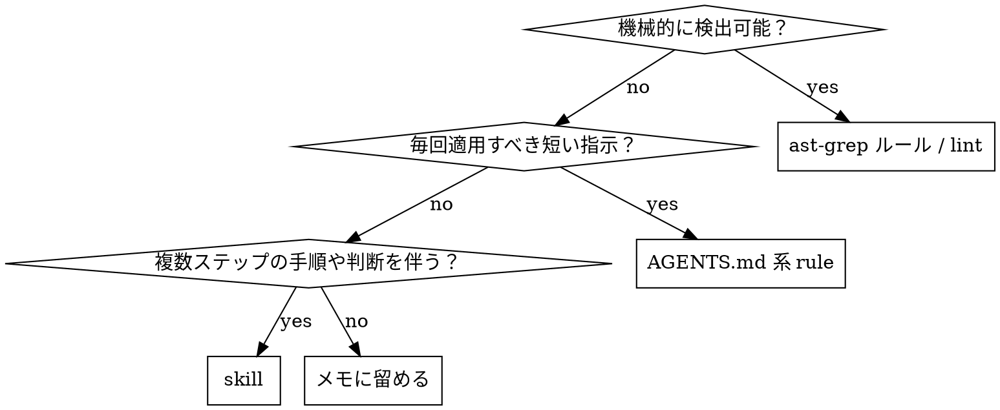

# Retrospective Codify

タスクの終盤で「最初にこれを知っていれば遠回りしなかった」知見を抽出し、静的ルール・skill・常時有効ルールのいずれかに固定する。
プロンプトに頼らず再現可能な形に落とすことを優先する。

Retrospective と Proposals による棚卸しを維持しつつ、常時有効ルールの書き出し先は `AGENTS.md` 系 source-of-truth を中心にする。
commit / push / APM pin 更新 / install は担当しない。

## いつ使うか

- タスク完了直前、またはユーザーから「学びを残して」「ルール化して」「codify して」と指示されたとき
- 試行錯誤の末に解にたどり着いたとき（初手で詰まった、誤った仮説を立てた、ドキュメント不足で時間を溶かした 等）
- 同種のタスクを将来また行う可能性があるとき

使わない場面:
- 一発で通った単純なタスク（抽出する学びがない）
- 再利用可能な初動ルールがない作業ログやメモ
- プロジェクト固有の一回限りの対応（コミットメッセージ / PR 説明で十分）
- commit / push / APM pin 更新 / install だけが目的の依頼

## ワークフロー

1. **失敗⇄成功の対応付け**: 今回のタスクから次の 3 点を書き出す。
   - 最初の試行（何をした / どう失敗した）
   - 最終解（何が効いた）
   - 橋渡しになった気付き（なぜ最初の試行では届かなかったか）
   - 3 点が明示されていない場合は、会話履歴から仮説を作ってよい。確信できない点はユーザーに確認する。
2. **「最初に知るべきだったこと」の言語化**: 気付きを 1〜3 文で要約する。回顧でなく、未来の自分への指示形で書く（「〜するな」/「〜を先に確認せよ」）。
3. **採用対象か判定する**: 「再利用可能で、次回の初動を変える知見」だけを採用候補にする。one-off、薄すぎる注意、機密を含む内容は不採用または session note に留める。
4. **分類する**: 下の判定表に従って出力先を決める。
5. **source-of-truth を確認する**: AGENTS.md 系 rule / skill / lint rule のどこを編集対象にするか決める。展開物や symlink 先を直接編集しない。
6. **重複チェック（必須）**: 提案前に既存の知見と照合する。重複や近接する規則があれば「新規追加」ではなく「既存への追記 / 更新」を選ぶ。これを怠ると skill / ルールが肥大化する。

   検索キー候補は気付きから 2〜3 語抽出する（ツール名・API 名・症状語・対義語）。例: 気付きが「pnpm v10 を使う」なら `pnpm`, `packageManager`, `lockfile`。

   照合先と最低限の検索:
   ```
   # project-local agent instructions
   Grep "<キー>" <project-root>/AGENTS.md
   Grep "<キー>" <project-root>/CLAUDE.md   # 存在し、実際に source-of-truth なら
   Grep "<キー>" <project-root>/.config/codex/instructions.md   # 存在する場合

   # project-local skills
   ls <project-root>/.claude/skills/ <project-root>/.agents/skills/ 2>/dev/null
   Grep "<キー>" <project-root>/.claude/skills/*/SKILL.md
   Grep "<キー>" <project-root>/.agents/skills/*/SKILL.md

   # global source-of-truth / installed skills
   Grep "<キー>" <dotfiles>/agents/AGENTS.md
   Grep "<キー>" <nananaman/skills>/meta <nananaman/skills>/engineering <nananaman/skills>/personal <nananaman/skills>/productivity
   Grep "<キー>" ~/.agents/skills/*/SKILL.md ~/.claude/skills/*/SKILL.md

   # lint rule duplicates
   ls <project-root>/rules/ <project-root>/rule-tests/ 2>/dev/null
   Grep "<キー>" <project-root>/sgconfig.yml <project-root>/rules/ <project-root>/rule-tests/
   ```

   結果を 4 段階に分類:
   - **新規**: ヒット無し → 通常の提案
   - **既存追記**: 関連 skill/ルールが存在し、追加情報が補完的 → 「既存に追記」を提案
     - 「部分重複」（学びの一部だけが既存カバー、残りが新規）もこの分類に含める。重複した部分は「重複検出」節に、新規部分は「採用候補」節（`[skill 追記]` または `[rule]`）に分けて書く。
   - **既存と重複（提案不要）**: 既存が同じ知見を完全にカバー済み → 提案ゼロ、ただし提示フォーマットには「重複検出」行を残す（監査可能性のため）。重複検出行には根拠として既存 skill / rule 名 + 該当節名（または行番号）を添える。
   - **判断保留**: agent が重複かどうか判定できない → ユーザーに照合結果を見せて判断を仰ぐ
7. **提示する**: 後述の「ユーザーへの提示フォーマット」に沿って Retrospective と Proposals を出す。承認前に永続ファイルを編集しない。
8. **承認後に書き出す**: ユーザーが採用を指示した項目だけを書き出す。skill を編集した場合は `skill-workbench` の Review diff branch を実行し、actionable finding があれば修正して再レビューする。

## 分類判定



| 判定軸 | 出力先 | 例 |
|---|---|---|
| コード/設定の構文レベルで検出可能 | `ast-grep` ルール または既存 linter 設定 | `Array.from(set).length` を使うな、`set.size` を使え |
| 短く、常時適用、判断を伴わない | `AGENTS.md` 系 source-of-truth（global / project） | pnpm は v10 以上を使う |
| 手順・文脈判断・テンプレが必要 | 新規 skill または既存 skill への追記 | MoonBit の C binding を書く手順 |
| プロジェクト固有で一回限り | 採用しない（コミットメッセージ / PR 説明に留める） | — |

**ast-grep を優先する原則**: 静的に検出可能なものはプロンプトやドキュメントに書かず、可能なら `ast-grep` ルールや既存 linter 設定にする。

**AGENTS.md 系 rule の書き出し先**:
- global の常時 rule → dotfiles 側の `agents/AGENTS.md` など、配布元の source-of-truth
- 特定リポジトリ限定 → そのリポジトリの `AGENTS.md`
- `AGENTS.md` がなく、`CLAUDE.md`、Codex instructions、その他 agent instructions が実際の source-of-truth なら、その実態を確認して候補にする
- `~/.claude/CLAUDE.md`、`~/.pi/agent/AGENTS.md`、`~/.config/codex/instructions.md` などのリンク先・展開先は直接編集しない

**skill の書き出し先**:
- 既存 skill に追記・修正できるなら、新規 skill を作らない
- 汎用 skill の source-of-truth は `nananaman/skills` とする
- project 固有 skill は対象 repo の project-local skills を候補にする
- `~/.agents/skills` / `~/.claude/skills` の展開物は直接編集しない

## 出力テンプレート

### ast-grep ルール
`ast-grep-practice` skill を参照。承認前は `rules/*.yml` と `rule-tests/*-test.yml` の YAML 案を提示するだけに留め、承認後に対象 repo の `rules/` / `rule-tests/` へ書き出す。対象 repo に ast-grep 基盤がない場合は、導入作業へ勝手に進まず future 候補として提示する。

### AGENTS.md 系 rule への追記
```markdown
# <既存セクションに追記>
- <命令形の 1 文>（理由: <短い根拠>）
```
理由を括弧書きで必ず添える（将来の自分が edge case を判断できるように）。

### 新規 skill
`skill-workbench` の Create / Improve branch の discoverability contract に従う:
```markdown
---
name: <kebab-case>
description: <positive trigger と negative trigger を含む routing 情報>
---

# <Title>

## 目的
## いつ使うか
## ワークフロー
## 落とし穴
```

## 具体例

### 例 1: ast-grep ルール化（機械検出可能）

- 最初の試行: TypeScript で集合のサイズを `Array.from(set).length` で取得していたが、レビューで非効率と指摘された。
- 最終解: `set.size` を使う。
- 気付き: `Set` / `Map` のサイズ取得は `.size` プロパティを使う。`Array.from(...).length` は構文レベルで検出可能。

→ `rules/no-array-from-size.yml` を追加候補にする:
```yaml
id: no-array-from-size
language: TypeScript
severity: warning
rule:
  pattern: Array.from($COLL).length
message: Set/Map のサイズは .size プロパティを使う。
```

### 例 2: AGENTS.md rule 化（短い常時ルール）

- 最初の試行: `pnpm install` を実行したら lockfile 形式の差分で CI が落ちた。
- 最終解: pnpm のバージョンを v10 系に揃えた。
- 気付き: pnpm はバージョン差で lockfile が変わる。常に v10 以上を使う。

→ dotfiles 側の `agents/AGENTS.md` の「ツール」節に追記候補を出す:
```markdown
- pnpm は v10 以上を使う（理由: lockfile 形式が v9 以前と非互換で CI 差分が出る）
```

### 例 3: 新規 skill 化（手順 + 判断を伴う）

- 最初の試行: MoonBit から C ライブラリを呼ぶのに、いくつかの方法を試して FFI 宣言と stub の配置で詰まった。
- 最終解: `extern "c"` 宣言 + `moonbit.h` を使った stub + `moon.pkg.json` の `native-stub` / `link.native` 設定の組み合わせ。
- 気付き: 単一手順では収まらず、宣言・stub・ビルド設定の 3 層を一括して理解する必要がある。

→ 新規 skill `moonbit-c-binding` として手順とテンプレを切り出し（既に存在する場合は、重複チェックで既存への追記を選ぶ）。

## Red flags（合理化に注意）

下記の思考が出たら一度止まる。

| 出てくる合理化 | 実態 |
|---|---|
| 「プロジェクト固有だけど一応 skill にしておこう」 | skill が肥大化し検索性が落ちる。コミットメッセージ / PR で十分。 |
| 「承認は省いて先に書き出しておこう、後で見せればいい」 | 勝手に AGENTS.md / skill / rule を変更すると将来の挙動が読めなくなる。必ず提案 → 承認 → 書き出し。 |
| 「ast-grep で書ける気もするけど、自然言語でルールに書いた方が早い」 | 静的検出可能なものを散文で書くと、エージェントが守らない。ast-grep / linter を優先。 |
| 「気付きが薄いけど、何か書かないと格好がつかない」 | 提案ゼロも正解。空の retrospective は害がない。 |
| 「重複チェックは面倒だから飛ばそう、被ったら後で消せばいい」 | 重複ルールが残ると挙動が割れる。dedup は必須工程。 |
| 「失敗の側は省いて、最終解だけ書けばいい」 | 失敗の記述がないと、将来の自分は同じ落とし穴に再度落ちる。 |

## ユーザーへの提示フォーマット

タスク終了時に次の形で棚卸しを提示する。**学びは複数あって良い。重複や不採用も明示的に列挙して、判断の足跡を残す。**

```md
## Retrospective

### 学び 1: <短いラベル>
- 最初の失敗: <1 行>
- 最終解: <1 行>
- 気付き: <1 行>

### 学び 2: <短いラベル>      # 学びが 1 つだけならこのブロックは省く
- 最初の失敗: <1 行>
- 最終解: <1 行>
- 気付き: <1 行>

## Proposals

採用候補:
1. [lint] <ルール名>: <1 行>（artifact: <path>, 学び N 由来）
2. [skill 追記] <既存 skill 名>: <1 行>（学び N 由来）
3. [skill 新規] <skill 名>: <1 行>（学び N 由来）
4. [rule] AGENTS.md（global/project）: <1 行>（学び N 由来）

重複検出（提案不要）:
- <学び N>: 既存 <skill/rule 名> の <該当節名 or 行番号> が完全カバー → 追加なし

不採用:
- <学び N>: <不採用理由 1 行>（例: プロジェクト固有 / cross-file で lint 表現困難 / 他の学びに吸収）

採用するものを番号または項目名で指示してください。提案ゼロも妥当な結論です。
```

**書式ルール:**
- 学びが 1 つなら `### 学び N` 見出しは省き、Retrospective ブロックを 1 つだけ書く
- 「採用候補」「重複検出」「不採用」のいずれかが空ならその節ごと省く（"なし" 行は書かない）
- 採用候補には `1.` から始まる連番を必ず付ける。番号は採用候補セクション内だけで採番し、重複検出や不採用には付けない
- 各提案行末に「学び N 由来」を必ず書く（複数学びを跨ぐ場合は「学び 1, 3 由来」のように列挙して良い）
- 「採用候補」が空で「重複検出」のみ残るときは、末尾文を `採用するものを指示してください` ではなく `採用候補なし。記録目的でレビューしてください。` に置き換える
- ユーザーが採用を指示した項目のみ書き出す。黙って書き出さない

### 提示例: 全学びが既存カバー（重複検出のみ）

```md
## Retrospective

### 学び 1: <ラベル>
- 最初の失敗: ...
- 最終解: ...
- 気付き: ...

## Proposals

重複検出（提案不要）:
- 学び 1: 既存 skill `<skill name>` の `<section name>` が完全カバー → 追加なし

採用候補なし。記録目的でレビューしてください。
```

### 提示例: 部分重複（既存追記 + 重複検出）

```md
## Proposals

採用候補:
1. [skill 追記] <existing skill name>: 新規部分を <section name> に追記する（学び 1 由来）

重複検出（提案不要）:
- 学び 1（version value 部分）: `agents/AGENTS.md` の tools 節で既にカバー → 追加なし
```

## Common failures

- **粒度が細かすぎる**: 特定関数名や特定バージョンだけを codify する → 「次に何を先に確認するか」の粒度まで抽象化する
- **プロンプトに書きがち**: 静的検出できるものを自然言語で AGENTS.md に書く → ast-grep / linter に寄せる
- **理由を書かない**: 将来の自分が edge case を判断できない → `理由:` を必ず添える
- **勝手に書き出す**: AGENTS.md や skill を承認前に更新する → 提案 → 承認 → 書き出しを守る
- **失敗の言語化を省く**: 最終解だけを書く → 同じ落とし穴に再度落ちる

## Done Criteria

- 失敗⇄成功⇄気付きの 3 点が確認済みである
- 再利用可能で次回の初動を変える知見か判定済みである
- dedup check を実行し、新規 / 既存追記 / 既存と重複 / 判断保留の分類を報告している
- 出力先と source-of-truth が明確である
- 採用候補・重複検出・不採用を、空節を省いた `Retrospective` / `Proposals` 形式で提示している
- 承認前に永続ファイルを編集していない
- 編集した場合、対象と理由を報告している
- skill 変更を行った場合、`skill-workbench` の Review diff branch を実行済みである
- commit / push / APM pin 更新 / install を実行していない

## 関連 skills

- `skill-workbench` — 新規 skill / 既存 skill 改善 / skill review / inventory audit
- `ast-grep-practice` — lint rule と test を書く場合
